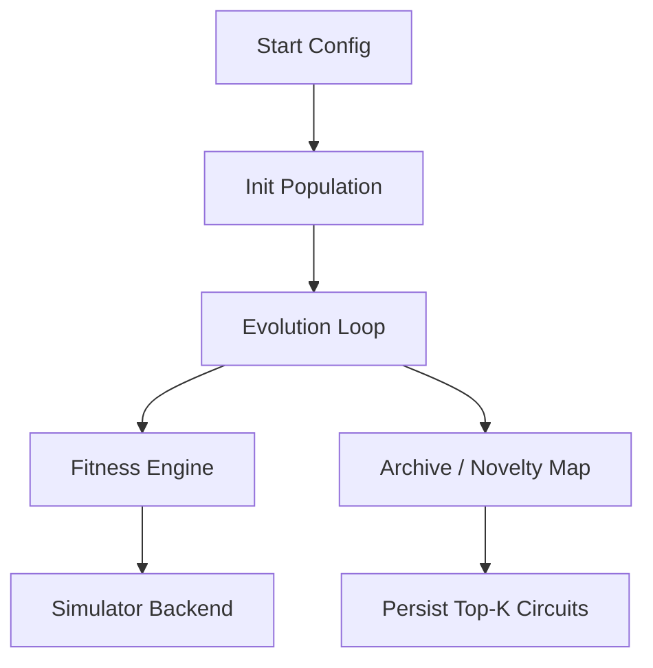
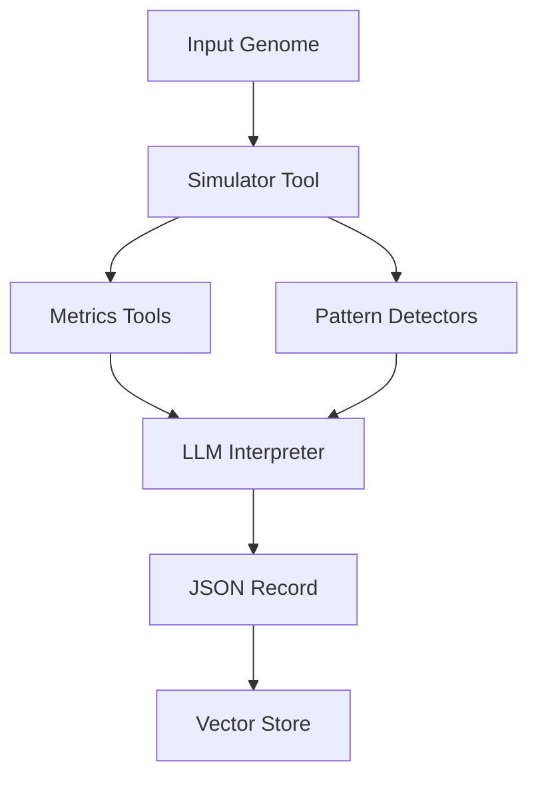
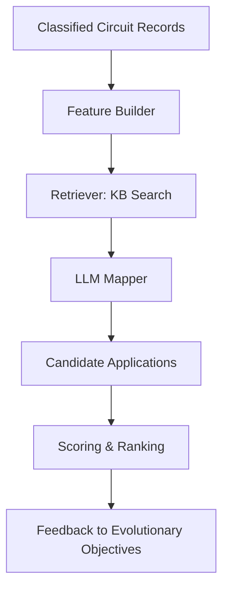
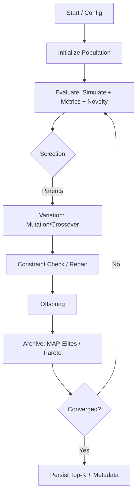
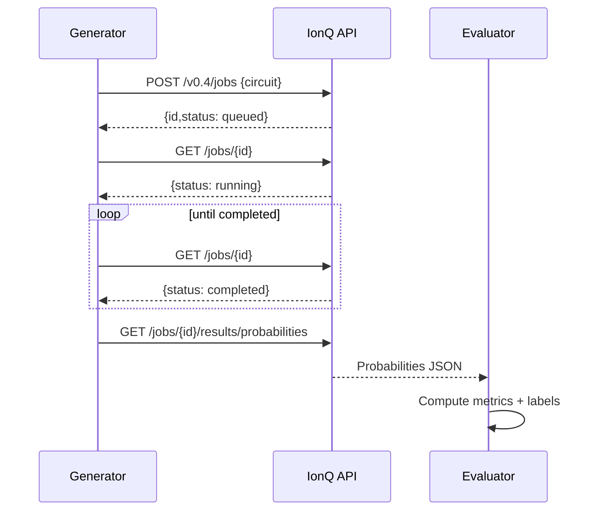
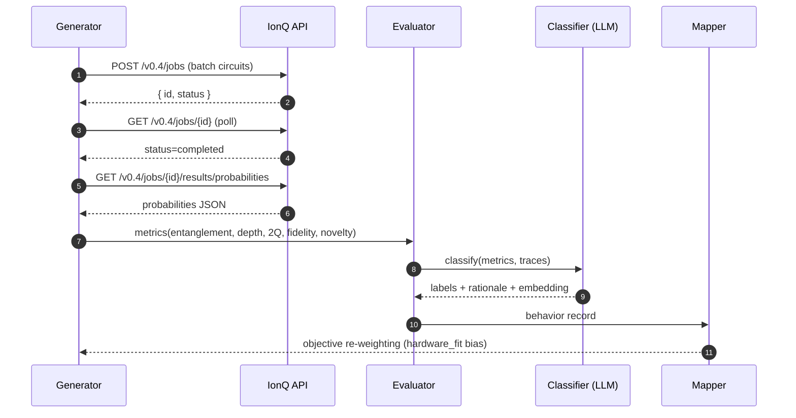

# Discover First, Apply Later (DFAL) — Expanded Provisional Patent Pack

> Three coordinated provisionals: (A) Evolutionary Quantum Circuit Generator, (B) Agentic AI Evaluation & Classification, (C) Post‑Hoc Application Mapping Feedback. Each section now includes **expanded claim sets (15–25 claims each)**, **Mermaid workflow figures**, and a **running todo list** for next steps.

---

## A) Evolutionary Quantum Circuit Generator

### Mermaid Workflow


### Expanded Claim Set (examples)
1. A method for discovering quantum circuits comprising: encoding candidate circuits as genomes; generating a population; applying mutation and crossover; evaluating metrics including entanglement and novelty; archiving diverse candidates.
2. The method of claim 1, wherein the metrics further comprise circuit depth and simulated fidelity.
3. The method of claim 1, wherein novelty is computed by k‑nearest neighbor distance in a behavior descriptor space.
4. The method of claim 1, wherein the hardware constraints are IonQ trapped‑ion native gates.
5. The method of claim 1, wherein the circuits are evolved using a MAP‑Elites archive.
6. A system comprising: a genome encoder; a simulator backend; a multi‑objective fitness engine; and a persistence store.
7. The system of claim 6, further comprising a novelty archive configured to preserve behaviorally diverse circuits.
8. A non‑transitory computer‑readable medium storing instructions that, when executed, perform the method of claim 1.
9. The medium of claim 8, wherein instructions include parallel evaluation on a cloud‑hosted trapped‑ion device.
10. A method of evolving circuits where initial populations include known primitives.
11. The method of claim 10, wherein the primitives comprise GHZ, Bell, or QFT blocks.
12. The method of claim 1, further comprising automatically generating embeddings of discovered circuits.
13. A system wherein evolutionary operators comprise insertion, deletion, parameter jitter, and qubit reassignment.
14. The method of claim 1, wherein a genetic algorithm is selected from NSGA‑II, SPEA2, or other multi‑objective optimization.
15. The method of claim 1, wherein discovered circuits are ranked by novelty‑weighted Pareto dominance.
16. The method of claim 1, wherein discovered circuits are stored with JSON metadata including genome, metrics, and embeddings.
17–25. (Variants covering hardware portability, error‑aware scoring, and quality‑diversity grid partitions).

---

## B) Agentic AI Evaluation & Classification

### Mermaid Workflow


### Expanded Claim Set (examples)
1. A system comprising: a simulator tool configured to execute circuits; a metrics module; a pattern detection module; and a language model configured to classify behaviors.
2. The system of claim 1, wherein the simulator is IonQ’s trapped‑ion backend.
3. A method comprising simulating a candidate circuit; computing entanglement, depth, and fidelity; classifying results via an LLM; and producing a JSON report.
4. The method of claim 3, wherein the JSON report includes embedding vectors for retrieval.
5. The system of claim 1, wherein the LLM produces a rationale and confidence value.
6. The system of claim 1, further comprising a schema for describing I/O specifications.
7. A non‑transitory computer‑readable medium storing instructions for performing the method of claim 3.
8. The method of claim 3, further comprising detecting GHZ, DJ, or QFT‑like signatures.
9. The method of claim 3, wherein classification triggers human‑in‑the‑loop review below confidence threshold.
10–25. (Dependent claims covering alternative metrics, embeddings, multi‑agent orchestration, integration with novelty search, IonQ calibration usage).

---

## C) Post‑Hoc Application Mapping Feedback

### Mermaid Workflow


### Expanded Claim Set (examples)
1. A method comprising retrieving classified circuit records; comparing to a knowledge base; generating application mappings via an LLM; and ranking results.
2. The method of claim 1, wherein mappings include confidence, novelty, and hardware‑fit scores.
3. A system comprising: a retriever module, a language model, and a scoring engine.
4. A non‑transitory computer‑readable medium storing instructions to perform the method of claim 1.
5. The method of claim 1, wherein feedback signals are applied to reweight fitness objectives.
6. The system of claim 3, wherein the knowledge base includes algorithm descriptors and embeddings.
7. The method of claim 1, wherein mappings prioritize IonQ‑relevant applications.
8. The system of claim 3, wherein scoring comprises relevance × hardware fit × novelty.
9–25. (Dependent claims covering novel app proposals, integration with novelty search, dynamic KB updates, and reinforcement loops).

---

## Running TODO List
- [ ] **Spin up worked examples** (sim outputs + metrics) → paste into provisionals.
- [ ] Decide first proof example: GHZ‑like finder vs QFT rediscovery.
- [ ] Lock claim boundaries now **vs** after one week of sim runs (to strengthen dependent claims).
- [ ] Add React/TS mockups for each workflow (companion UI diagrams for provisionals).

---

This expanded pack now includes **claim sets, Mermaid diagrams, and TODOs**. Next deliverables: (1) worked examples with real metrics, (2) React mockups of workflows, (3) refined dependent claim drafting once early sim results are in.


---

# Expanded Claim Sets (v0.1)

## Filing 1 — Evolutionary Quantum Circuit Generator

### Independent Claims
1. **Method** for automated discovery of quantum circuits comprising: encoding candidate circuits as genomes; generating an initial population; evaluating each candidate by multi‑objective quantum metrics and a novelty metric; selecting candidates based on fitness; applying mutation and crossover under hardware constraints to produce offspring; iterating to converge; and persisting discovered circuits with behavior metadata.
2. **System** comprising: a genome encoder; a population manager; an evaluation engine configured to compute entanglement, depth, two‑qubit count, fidelity under a noise model, and novelty; a variation engine with mutation and crossover; and a repository storing circuits and metadata.
3. **Non‑transitory computer‑readable medium (CRM)** storing instructions that when executed cause one or more processors to perform the method of claim 1.

### Dependent Claims
4. The method of claim 1 wherein hardware constraints comprise a trapped‑ion native gate set including GPI, GPI2, and XX gates with all‑to‑all connectivity.
5. The method of claim 1 wherein the novelty metric is computed as an average distance in a behavior‑descriptor embedding space to *k* nearest archive entries.
6. The method of claim 1 wherein the multi‑objective fitness is solved by a Pareto‑ranking algorithm selected from NSGA‑II or SPEA2.
7. The method of claim 1 further comprising maintaining a quality‑diversity archive using MAP‑Elites bins on entanglement and depth.
8. The method of claim 1 wherein mutation comprises at least one of: gate insertion, deletion, parameter jitter, and qubit reassignment respecting connectivity.
9. The method of claim 1 wherein crossover comprises splice‑and‑swap of subsequences between two parent genomes.
10. The method of claim 1 wherein evaluation is performed by a noisy simulator parameterized by device calibration data.
11. The method of claim 1 further comprising spot‑validation of a subset of circuits on a quantum processing unit (QPU) via a cloud interface.
12. The method of claim 1 wherein the repository stores JSON metadata including genome, metrics, labels, and an embedding vector for retrieval.
13. The system of claim 2 wherein the evaluation engine computes Meyer–Wallach entanglement and output distribution diversity.
14. The system of claim 2 wherein the variation engine enforces parameter snapping to calibrated rotation angles.
15. The CRM of claim 3 wherein the instructions further cause adjustment of objective weights responsive to application signals received from an external mapper.
16. The method of claim 1 wherein initialization seeds populations with primitive blocks selected from Bell, GHZ, W, QFT, or Grover subcircuits.
17. The system of claim 2 wherein a scheduler parallelizes evaluations across simulator instances and QPU queues.
18. The method of claim 1 further comprising rejecting offspring violating maximum depth or two‑qubit count thresholds.
19. The system of claim 2 wherein behavior descriptors include spectra or stabilizer signatures of output states.
20. The CRM of claim 3 wherein the instructions further maintain a novelty archive with aging and replacement policies.

---

## Filing 2 — Agentic AI Evaluation & Classification System

### Independent Claims
1. **System** comprising: a simulator tool to execute a quantum circuit; a metrics tool to compute quantum metrics; a classification agent comprising a large language model (LLM) configured to generate semantic labels and a textual description from the metrics and traces; and a persistence layer to store a structured record with an embedding.
2. **Method** of evaluating and classifying a quantum circuit comprising: simulating the circuit; computing metrics; detecting patterns; prompting an LLM to generate labels and rationale; and storing a JSON record including an embedding for retrieval.
3. **CRM** storing instructions that when executed cause one or more processors to perform the method of claim 2.

### Dependent Claims
4. The system of claim 1 wherein the simulator comprises a noisy density‑matrix engine parameterized by trapped‑ion calibration.
5. The system of claim 1 further comprising pattern detectors for at least GHZ‑like, Deutsch–Jozsa‑like, and QFT‑like signatures.
6. The method of claim 2 wherein the LLM is few‑shot prompted with exemplar metric‑to‑label mappings.
7. The method of claim 2 further comprising computing a confidence score and withholding low‑confidence labels for human review.
8. The method of claim 2 wherein the JSON record includes an inferred input/output specification with example output distributions.
9. The system of claim 1 wherein the persistence layer stores a vector embedding derived from the labels, description, and metrics.
10. The CRM of claim 3 wherein the instructions further generate alternative label sets under different temperature or prompt variants and select by consensus.
11. The method of claim 2 wherein the metrics include entanglement entropy, mutual information, circuit depth, two‑qubit count, and simulated fidelity.
12. The system of claim 1 wherein the classification agent performs retrieval‑augmented prompting against a knowledge base of quantum primitives.
13. The method of claim 2 further comprising assigning taxonomy tags from a controlled vocabulary.
14. The system of claim 1 wherein outputs are streamed to a message bus for downstream consumers.
15. The CRM of claim 3 wherein the instructions generate a behavior embedding using a learned encoder trained on labeled circuits.
16. The method of claim 2 wherein simulation results are merged with spot‑hardware measurements when available.
17. The system of claim 1 wherein guardrails detect out‑of‑distribution metrics and trigger fallback workflows.
18. The method of claim 2 further comprising versioning the record and maintaining provenance metadata for reproducibility.
19. The system of claim 1 wherein evaluation is batched and parallelized with retry logic on tool failures.
20. The CRM of claim 3 wherein instructions output a standardized JSON schema suitable for indexing by a vector database.

---

## Filing 3 — Post Hoc Application Mapping Feedback

### Independent Claims
1. **Method** of mapping discovered quantum circuit behaviors to applications comprising: retrieving a classified behavior record; retrieving similar algorithm patterns from a knowledge base using embedding similarity; prompting an LLM to propose candidate application mappings with rationales; ranking candidates by a multi‑factor score; and persisting ranked mappings.
2. **System** comprising: a behavior index; a knowledge base of algorithm patterns; a mapping engine configured for retrieval and LLM‑based proposal generation; and a feedback module to emit objective re‑weighting signals to a circuit generator.
3. **CRM** storing instructions that when executed cause one or more processors to perform the method of claim 1.

### Dependent Claims
4. The method of claim 1 wherein the multi‑factor score comprises relevance, hardware fit, and novelty.
5. The system of claim 2 wherein hardware fit is biased toward trapped‑ion architectures with all‑to‑all connectivity.
6. The method of claim 1 further comprising generating a validation plan specifying tests to confirm the proposed application.
7. The method of claim 1 wherein retrieval uses approximate nearest‑neighbor search over behavior embeddings.
8. The system of claim 2 wherein the knowledge base comprises records of known quantum algorithms, primitives, and use cases with embeddings.
9. The method of claim 1 further comprising emitting reinforcement signals to increase weights on fitness objectives correlated with high‑score mappings.
10. The CRM of claim 3 wherein instructions threshold low‑confidence mappings for human review.
11. The method of claim 1 wherein the LLM leverages chain‑of‑thought constrained prompts to produce structured rationales (stored but not exposed at runtime).* 
12. The system of claim 2 wherein the feedback module interfaces with a quality‑diversity archive to bias exploration toward under‑explored behavior bins.
13. The method of claim 1 further comprising logging provenance linking mappings to specific circuit versions and evaluation contexts.
14. The system of claim 2 wherein value scores incorporate external business heuristics.
15. The CRM of claim 3 wherein instructions periodically retrain the embedding model using accepted mappings.
16. The method of claim 1 wherein candidate applications include at least one of: QKD primitives, metrology, VQE ansatz seeds, oracles, and error‑mitigation subroutines.
17. The system of claim 2 wherein the mapping engine performs retrieval‑augmented generation with citations to KB entries.
18. The method of claim 1 wherein ranking includes Monte Carlo sampling over mapping uncertainties.
19. The system of claim 2 wherein the feedback module exposes an API for external controllers to set application priorities.
20. The CRM of claim 3 wherein instructions generate dashboards summarizing mapping distributions and their evolution.

> *Note: adjust internal reasoning language per counsel’s preference for prosecution. The substantive behavior remains: producing structured rationales.

---

# Mermaid Diagrams (Workflows)

## A) Evolutionary Quantum Circuit Generator


## B) Agentic AI Evaluation & Classification
```mermaid
flowchart TD
  A[Genome/Circuit] --> B[Simulate (Noisy/Hardware)]
  B --> C[Compute Metrics]
  B --> D[Pattern Detectors]
  C --> E[LLM Classifier]
  D --> E
  E --> F[Build JSON Record + Embedding]
  F --> G[Vector Store / Catalog]
```

## C) Application Mapping & Feedback
```mermaid
flowchart TD
  A[Classified Circuit Record] --> B[Retrieve Similar Algorithms (KB)]
  B --> C[LLM Propose Mappings + Rationales]
  C --> D[Rank by Relevance × Hardware Fit × Novelty]
  D --> E[Persist Top-N Mappings]
  D --> F[Emit Objective Reweighting to Generator]
```

---

# React Mockup (Workflow Cards)

```tsx
import React from "react";
import { Card, CardContent, CardHeader, CardTitle } from "@/components/ui/card";
import { ArrowRight } from "lucide-react";

export default function DFALWorkflows() {
  const flows = [
    {
      title: "Evolutionary Generator",
      steps: [
        "Init population",
        "Simulate & score (entanglement, depth, 2Q, fidelity, novelty)",
        "Selection → mutation/crossover",
        "Constraint check",
        "QD archive & Pareto rank",
        "Persist Top‑K"
      ]
    },
    {
      title: "Agentic Evaluation",
      steps: [
        "Simulate circuit (noisy/hardware)",
        "Compute metrics + detect signatures",
        "LLM classify (labels + rationale)",
        "JSON record + embedding",
        "Catalog"
      ]
    },
    {
      title: "Application Mapping",
      steps: [
        "Retrieve similar algos from KB",
        "LLM propose mappings",
        "Rank by relevance × hardware fit × novelty",
        "Persist + feedback to GA"
      ]
    }
  ];
  return (
    <div className="grid gap-6 md:grid-cols-3 p-6">
      {flows.map((f) => (
        <Card key={f.title} className="rounded-2xl shadow">
          <CardHeader>
            <CardTitle className="text-xl">{f.title}</CardTitle>
          </CardHeader>
          <CardContent>
            <ul className="space-y-2">
              {f.steps.map((s, i) => (
                <li key={i} className="flex items-start gap-2">
                  <ArrowRight className="h-4 w-4 mt-1" />
                  <span>{s}</span>
                </li>
              ))}
            </ul>
          </CardContent>
        </Card>
      ))}
    </div>
  );
}
```

---

# IonQ REST Embodiments (v0.2)

## Filing 1 — Generator (REST Embodiment)
- **Submit multi-circuit batch:** `POST https://api.ionq.co/v0.3/jobs` with `input: [ {...}, {...} ]` for offspring evaluation.
- **Native gates constraint:** set `gateset: "native"` and restrict genome ops to GPI, GPI2, MS (Aria) or ZZ (Forte).
- **Backend targets:** `simulator` (ideal), `aria-1` (hardware), `noisy_simulator` (if exposed). Include noise and error_mitigation fields.

**cURL Example:**
```bash
curl -X POST "https://api.ionq.co/v0.3/jobs" \
  -H "Authorization: apiKey $IONQ_API_KEY" \
  -H "Content-Type: application/json" \
  -d '{
    "name": "gen-12-evals",
    "target": "simulator",
    "shots": 512,
    "input": [
      {"format":"ionq.circuit.v0","qubits":3,"circuit":[{"gate":"h","target":0} ]},
      {"format":"ionq.circuit.v0","qubits":3,"circuit":[{"gate":"x","target":1} ]}
    ],
    "noise": { "model": "harmony" },
    "error_mitigation": { "debias": false }
  }'
```

## Filing 2 — Evaluation (REST Adapter)
- Replace local simulator with IonQ REST adapter (v0.4).
- Flow: `POST /jobs` → poll `GET /v0.4/jobs/{id}` → fetch `GET /v0.4/jobs/{id}/results/probabilities`.
- Use `stats.gate_counts`, `stats.qubits` for depth/2Q metrics.

**Adapter (TS/Node):**
```ts
async function ionqSubmit(job: any, apiKey: string): Promise<string> {
  const r = await fetch("https://api.ionq.co/v0.4/jobs", { method:"POST", headers:{"Authorization":`apiKey ${apiKey}`,"Content-Type":"application/json"}, body: JSON.stringify(job)});
  const j = await r.json(); return j.id;
}

async function ionqWaitAndResults(id: string, apiKey: string) {
  while (true) {
    const jr = await fetch(`https://api.ionq.co/v0.4/jobs/${id}`, { headers:{"Authorization":`apiKey ${apiKey}`} });
    const j = await jr.json();
    if (j.status==="completed") {
      const pr = await fetch(`https://api.ionq.co/v0.4/jobs/${id}/results/probabilities`, { headers:{"Authorization":`apiKey ${apiKey}`} });
      return { job:j, probs: await pr.json() };
    }
    if (["failed","canceled"].includes(j.status)) throw new Error(`Job ${j.status}`);
    await new Promise(r => setTimeout(r, 1500));
  }
}
```

## Filing 2 — Worked Example (GHZ)
```jsonc
{
  "name": "ghz-3q",
  "target": "simulator",
  "shots": 2000,
  "input": {
    "format": "ionq.circuit.v0",
    "qubits": 3,
    "circuit": [
      { "gate": "h",    "target": 0 },
      { "gate": "cnot", "control": 0, "target": 1 },
      { "gate": "cnot", "control": 0, "target": 2 }
    ]
  }
}
```

## Filing 1 — Worked Example (GHZ, Native Gates)
```jsonc
{
  "name": "ghz-3q-native",
  "target": "simulator",
  "shots": 2000,
  "input": {
    "gateset": "native",
    "qubits": 3,
    "circuit": [
      { "gate": "gpi2", "phase": 0, "target": 0 },
      { "gate": "ms",   "phases": [0,0], "targets": [0,1] },
      { "gate": "ms",   "phases": [0,0], "targets": [0,2] }
    ]
  }
}
```

## Filing 3 — Mapping (Hardware-Fit)
- Add scoring using `job.stats.gate_counts`, `depth`, and backend ID.
- Boost scores for native-gate compliant, shallow-depth, low-2Q circuits.

## Mermaid Swimlane — REST Evaluation Flow


---

# Running TODO (live)
- [ ] **Worked examples**: implement GHZ‑like finder (3–4 qubits, shallow depth) and QFT‑signature rediscovery; produce JSON reports + diagrams for inclusion.
- [ ] **Pick first demo**: **Recommend GHZ‑like first** (clean entanglement metrics, short depth, IonQ‑friendly), then QFT rediscovery.
- [ ] **Lock claims timing**: **File now** with broad independents + rich dependent sets; run a week of sims; adjust dependent claims and add continuation material in the non‑provisional. Optionally file a supplemental provisional update later within 12 months with improved embodiments.
- [ ] **IonQ embodiment polish**: parameter‑snapping, error budgets, and spot‑hardware validation language.
- [ ] **Figures**: export Mermaid to SVG and include in each filing.


---

# IonQ REST Embodiments (Drop‑In)

## A) Generator — Multi‑Circuit Batch Evaluation via IonQ
**Purpose:** Evaluate a generation’s offspring as a single job to reduce overhead and keep novelty archive current.

**cURL (v0.3) — Pack multiple circuits**
```bash
curl -X POST "https://api.ionq.co/v0.3/jobs" \
  -H "Authorization: apiKey $IONQ_API_KEY" \
  -H "Content-Type: application/json" \
  -d '{
    "name": "gen-12-evals",
    "target": "simulator",
    "shots": 512,
    "input": [
      { "format":"ionq.circuit.v0","qubits":3,"circuit":[ /* child #1 */ ] },
      { "format":"ionq.circuit.v0","qubits":3,"circuit":[ /* child #2 */ ] }
    ],
    "noise": { "model": "harmony" },
    "error_mitigation": { "debias": false }
  }'
```

**Native‑gates payload (Aria)**
```json
{
  "name": "native-demo",
  "target": "simulator",
  "shots": 1024,
  "input": {
    "gateset": "native",
    "qubits": 2,
    "circuit": [
      { "gate": "ms",  "targets": [0,1], "phases": [0,0] },
      { "gate": "gpi", "phase": 0, "target": 0 },
      { "gate": "gpi2","phase": 0, "target": 1 }
    ]
  }
}
```

## B) Evaluation — IonQ REST Adapter
**TypeScript (Node) adapter used by Filing 2**
```ts
async function ionqSubmit(job: any, apiKey: string): Promise<string> {
  const r = await fetch("https://api.ionq.co/v0.4/jobs", {
    method: "POST",
    headers: { "Authorization": `apiKey ${apiKey}`, "Content-Type":"application/json" },
    body: JSON.stringify(job)
  });
  const j = await r.json();
  return j.id as string;
}

async function ionqWaitAndResults(id: string, apiKey: string) {
  while (true) {
    const jr = await fetch(`https://api.ionq.co/v0.4/jobs/${id}`, { headers: { "Authorization": `apiKey ${apiKey}` }});
    const j = await jr.json();
    if (j.status === "completed") {
      const pr = await fetch(`https://api.ionq.co/v0.4/jobs/${id}/results/probabilities`, { headers: { "Authorization": `apiKey ${apiKey}` }});
      return { job: j, probs: await pr.json() };
    }
    if (j.status === "failed" || j.status === "canceled") throw new Error(`Job ${j.status}`);
    await new Promise(r => setTimeout(r, 1500));
  }
}
```

**Worked Example — GHZ (QIS)**
```json
{
  "name": "ghz-3q",
  "target": "simulator",
  "shots": 2000,
  "input": {
    "format": "ionq.circuit.v0",
    "qubits": 3,
    "circuit": [
      { "gate": "h",    "target": 0 },
      { "gate": "cnot", "control": 0, "target": 1 },
      { "gate": "cnot", "control": 0, "target": 2 }
    ]
  }
}
```

**Worked Example — GHZ (Native, Aria)**
```json
{
  "name": "ghz-3q-native",
  "target": "simulator",
  "shots": 2000,
  "input": {
    "gateset": "native",
    "qubits": 3,
    "circuit": [
      { "gate": "gpi2", "phase": 0, "target": 0 },
      { "gate": "ms",   "phases": [0,0], "targets": [0,1] },
      { "gate": "ms",   "phases": [0,0], "targets": [0,2] }
    ]
  }
}
```

## C) Application Mapping — Hardware‑Fit Signals
- Read from `job.stats.gate_counts`, `job.results.depth`, backend name, and noise model.
- Define **hardware_fit = f(native_compliance, 2Q_budget, depth, fidelity_est)**.
- Prefer native‑compliant circuits for IonQ‑aligned mappings.

## Mermaid Swimlane — REST‑backed Loop


---

# Running TODO (updated)
- [ ] **Export Mermaid SVGs** and slot under each filing section.
- [ ] **Worked examples**: run GHZ on simulator + noisy model; capture probabilities & gate_counts for inclusion.
- [ ] **QFT rediscovery**: build 3–4q QFT in QIS, then transpile to native; compare metrics.
- [ ] **Hardware‑fit score**: finalize formula and add as dependent claims in Filing 3.
- [ ] **Node quickstart**: .env + npm scripts + minimal TS client committed.

---

# Node Quickstart — IonQ API in 30 seconds

## .env
```
IONQ_API_KEY=sk_live_...
IONQ_API_URL=https://api.ionq.co
IONQ_API_VERSION=v0.4
```

## package.json (scripts)
```json
{
  "name": "dfal-ionq-cli",
  "private": true,
  "type": "module",
  "scripts": {
    "dev": "tsx src/cli.ts",
    "ghz:qis": "tsx src/jobs/ghz_qis.ts",
    "ghz:native": "tsx src/jobs/ghz_native.ts",
    "batch": "tsx src/jobs/batch_eval.ts"
  },
  "dependencies": {
    "dotenv": "^16.4.5",
    "node-fetch": "^3.3.2",
    "tsx": "^4.16.0"
  }
}
```

## src/lib/ionq.ts
```ts
import 'dotenv/config';
const BASE = process.env.IONQ_API_URL ?? 'https://api.ionq.co';
const VER = process.env.IONQ_API_VERSION ?? 'v0.4';
const KEY = process.env.IONQ_API_KEY ?? '';
const H = { 'Authorization': `apiKey ${KEY}`, 'Content-Type': 'application/json' };

export async function submit(job: any) {
  const r = await fetch(`${BASE}/${VER}/jobs`, { method: 'POST', headers: H, body: JSON.stringify(job) });
  if (!r.ok) throw new Error(await r.text());
  return r.json();
}
export async function getJob(id: string) {
  const r = await fetch(`${BASE}/${VER}/jobs/${id}`, { headers: H });
  if (!r.ok) throw new Error(await r.text());
  return r.json();
}
export async function getProbs(id: string) {
  const r = await fetch(`${BASE}/${VER}/jobs/${id}/results/probabilities`, { headers: H });
  if (!r.ok) throw new Error(await r.text());
  return r.json();
}
export async function wait(id: string, ms = 1500) {
  for (;;) {
    const j = await getJob(id);
    if (j.status === 'completed') return j;
    if (j.status === 'failed' || j.status === 'canceled') throw new Error(`Job ${j.status}`);
    await new Promise(res => setTimeout(res, ms));
  }
}
```

## src/jobs/ghz_qis.ts
```ts
import { submit, wait, getProbs } from '../lib/ionq.js';

const job = {
  name: 'ghz-3q', target: 'simulator', shots: 2000,
  input: { format: 'ionq.circuit.v0', qubits: 3, circuit: [
    { gate: 'h', target: 0 },
    { gate: 'cnot', control: 0, target: 1 },
    { gate: 'cnot', control: 0, target: 2 }
  ]}
};

const { id } = await submit(job);
console.log('submitted', id);
await wait(id);
const probs = await getProbs(id);
console.log(JSON.stringify(probs, null, 2));
```

## src/jobs/ghz_native.ts
```ts
import { submit, wait, getProbs } from '../lib/ionq.js';

const job = {
  name: 'ghz-3q-native', target: 'simulator', shots: 2000,
  input: { gateset: 'native', qubits: 3, circuit: [
    { gate: 'gpi2', phase: 0, target: 0 },
    { gate: 'ms', phases: [0,0], targets: [0,1] },
    { gate: 'ms', phases: [0,0], targets: [0,2] }
  ]}
};

const { id } = await submit(job);
console.log('submitted', id);
await wait(id);
const probs = await getProbs(id);
console.log(JSON.stringify(probs, null, 2));
```

## src/jobs/batch_eval.ts
```ts
import { submit, wait, getProbs } from '../lib/ionq.js';

const job = {
  name: 'gen-12-evals', target: 'simulator', shots: 512,
  input: [
    { format: 'ionq.circuit.v0', qubits: 3, circuit: [ { gate: 'h', target: 0 } ] },
    { format: 'ionq.circuit.v0', qubits: 3, circuit: [ { gate: 'x', target: 1 } ] }
  ]
};

const { id } = await submit(job);
console.log('submitted', id);
await wait(id);
const probs = await getProbs(id);
console.log(JSON.stringify(probs, null, 2));
```

## Usage
```bash
npm i
cp .env.example .env   # or create .env with your API key
npm run ghz:qis        # prints probability vector
npm run ghz:native
npm run batch
```

